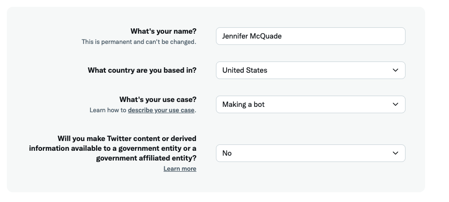
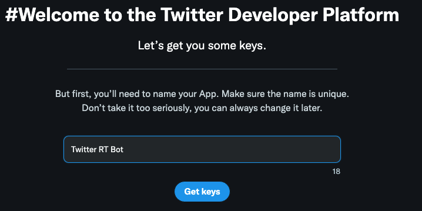
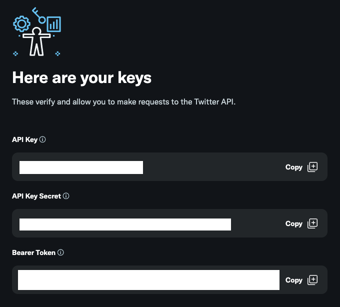

# Twitter Retweeter

## Overview

Fork of https://github.com/megancoyle/twitter-bot

This is a twitter bot that will retweet and/or like messages from Twitter users in a list from the last (n) days.

# Easy Installation via Heroku
> Note: When configuring Twitter variables, the first two are your keys for Step 5.

After the app is set up, go to the app's overview screen and click on the scheduler addon. Add a new task, type in "node index.js" and set the frequency you'd like the bot to update to Twitter to. I recommend only scheduling for twice a day, to cut down on Heroku Dyno run time and help to not give the impression to your Twitter followers that your account itself is a bot.

I also recommend using very specific values for KEYWORDS, seperated by a comma. For example, I use this bot to retweet new episodes for my friends who have podcasts, so I use "new episode". Just using "new" could include a lot of tweets I don't want to share automatically, and just including "episode" could end up retweeting every time an account discusses their recent episode.

# How to get your Twitter keys
You can register a new Twitter app in order to generate the API keys here:
https://developer.twitter.com/en/portal/petition/essential/basic-info

## Fill out some basic info

## Give your twitter bot app a name

## Save your API keys
Make sure you store your API Key (Access Token), API Secret (Access Secret), and Bearer token somewhere safe.

## In your app settings, click Access Token & Secret
These are the keys uniquely associated with the Twitter account you used to setup the app. These are needed in order to have your bot run as if it is you. Store these in a safe place as well.

## Technologies Used

- [Node.js](https://nodejs.org/en/)
- [twit](https://github.com/ttezel/twit): Twitter API client for Node.js
- [Heroku](http://heroku.com/): platform for deployed applications
