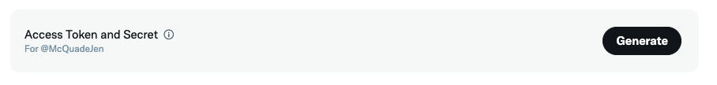
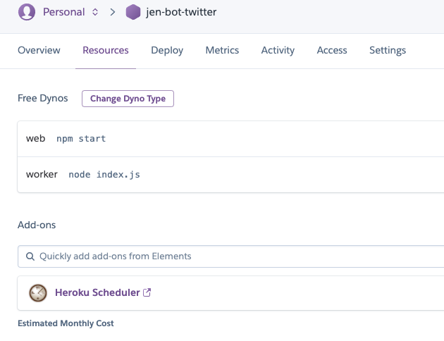

# Twitter Retweeter

## Overview

Fork of https://github.com/megancoyle/twitter-bot

This is a twitter bot that will retweet and/or like messages from Twitter users in a list from the last (n) days.

# Easy Installation via Heroku
> Note: When configuring Twitter variables, the first two are your [Access Token & Secret]("#access-keys").

After the app is set up, go to the app's overview screen and click on the scheduler addon. Add a new task, type in "node index.js" and set the frequency you'd like the bot to update to Twitter to. I recommend only scheduling for twice a day, to cut down on Heroku Dyno run time and help to not give the impression to your Twitter followers that your account itself is a bot.

I also recommend using very specific values for KEYWORDS, seperated by a comma. For example, I use this bot to retweet new episodes for my friends who have podcasts, so I use "new episode". Just using "new" could include a lot of tweets I don't want to share automatically, and just including "episode" could end up retweeting every time an account discusses their recent episode.

# Setup
Everything is free except for the time spent and some personal info for account registrations
> This Twitter bot requires some setup before you hit that deploy buttong
> 1. Create a free [Heroku account](https://signup.heroku.com/login). Using some features of Heroku may require a credit card, but there is very, very little chance you will be charged for using this deployed app, unless you abuse how often it runs to an extreme degree. I've had this deployed since October 2021, and have never had to pay for using this app.
> 2. Sign up for a [Twitter developer account](https://developer.twitter.com/en/portal/dashboard)
> 3. Create a Twitter app from the Twitter dashboard
> 4. Apply for *Elevated* Twitter app access [here](https://developer.twitter.com/en/docs/twitter-ads-api/apply) - Don't be intimidated by how many business-level questions the form asks. As long as you're honest, you don't have to go into great detail, and you'll be approved usually within one business day. The *Elevated* column [here](https://developer.twitter.com/en/docs/twitter-api/getting-started/about-twitter-api#v2-access-level) lists the extra features that you'll have access to when you're approved.

# How to get your Twitter keys
You can register a new Twitter app in order to generate the API keys here:
https://developer.twitter.com/en/portal/petition/essential/basic-info

## Fill out some basic info

## Give your twitter bot app a name

## Save your API keys
Make sure you store your API Key (Access Token), API Secret (Access Secret), and Bearer token somewhere safe.

## In your app settings, click Access Token & Secret
These are the keys uniquely associated with the Twitter account you used to setup the app. These are needed in order to have your bot run as if it is you. Store these in a safe place as well.

# How to Setup the Scheduler
Login and manage your new Heroku app, then click the `Resources` tab, then click on the `Heroku Scheduler` link

Click the `Create job` button

Set a schedule for when the bot should run. I recommend creating *two* jobs that run every day at an AM and PM time.
> Enter `node index.js` in the "Run Command" section
>
> 

# Changinging your settings
When managing your Heroku app, click the `Settings` tab at the top. Then click the "Reveal Config Vars" button. Click the pencil icon next to a setting to edit it.

## Technologies Used

- [Node.js](https://nodejs.org/en/)
- [twit](https://github.com/ttezel/twit): Twitter API client for Node.js
- [Heroku](http://heroku.com/): platform for deployed applications
